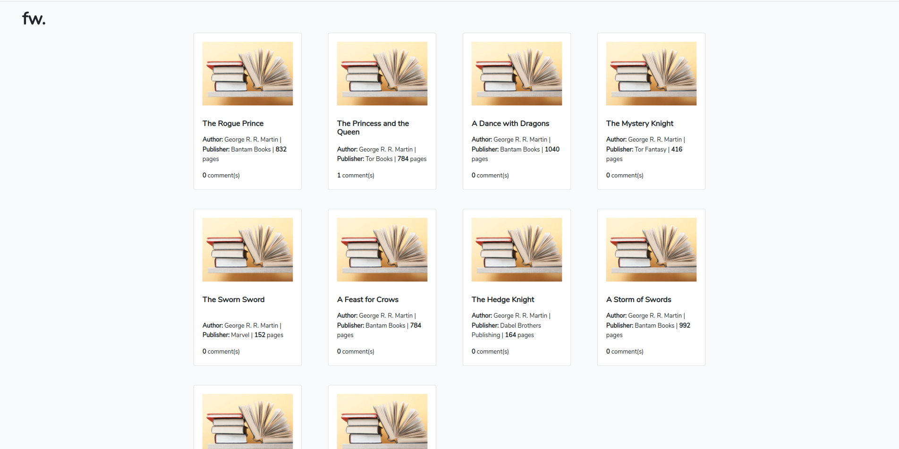
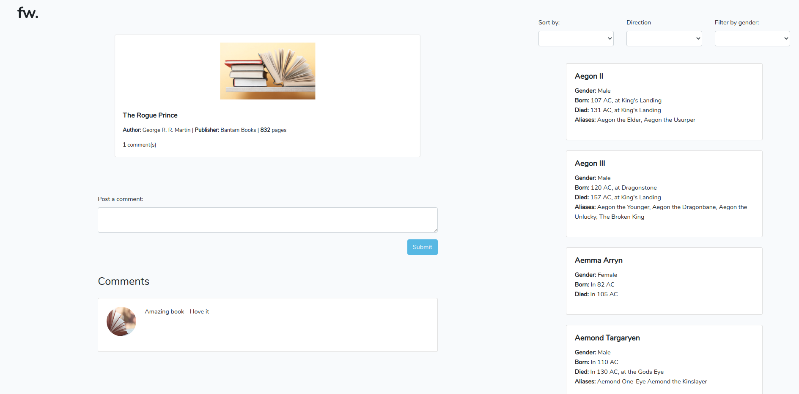

# Introduction
Fw is a mini e-library that is used to display books with their details and what various readers has to say about the individual books in the comment sections.

#### Home page

#### Detail page

# Overview
This API utilizies the collections that are readily available at `https://anapioficeandfire.com/` where the books where originally hosted. Fw basically use all that data and meta-data gotten from `anapioficeandfire` as is, however some features such as comment section, filtering and sorting were added which does not in any way change the original data, in other words - just for presentation purposes.

## How to setup locally

- Clone the repository
- Open the project in a terminal of your choice.
- Rename `.env.example` file in the root folder of the project to `.env`.
- Update the `.env` file with your credentials.
- Run `composer install` in your terminal to install depencencies.
- Run `yarn install` or `npm install` to install javascript dependencies.
- Run `php artisan key:generate` to generate APP_KEY.
- Run `php artisan migrate` to migrate database migrations.
- Run `yarn run dev` or `npm run dev` to compile assets.
- Finally you need to run `php artisan serve` to launch the project locally, then visit the generated address in your favorite browser if it does not launch automatically.

## License

The Laravel framework is open-sourced software licensed under the [MIT license](https://opensource.org/licenses/MIT).
